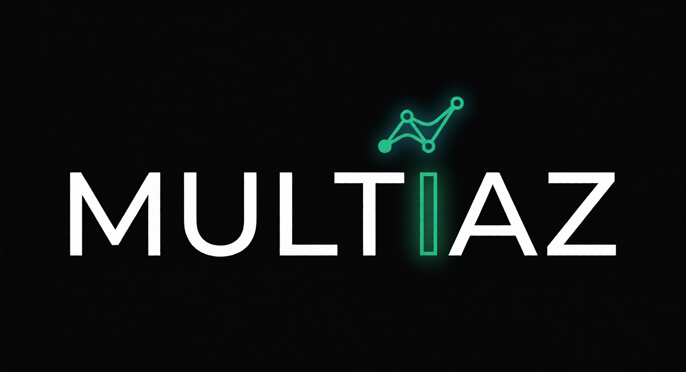

<div align="center">
    <h1>MultIAZ — Plataforma de Predicción Especializada</h1>
    
    <br/><br/>
    
    <br/>
    
        <br/>
    
    
    
    
    <br/>
    
    
    
    
    
    <br/>
    
    
    
    <br/>
    
    <br/><br/>
</div>

> Plataforma genérica, escalable y agnóstica para registrar, orquestar y consumir modelos de IA como plugins independientes. Predicciones en tiempo real y por lotes, accesibles desde una app móvil y un panel de administración web.

---
 
## Tabla de Contenidos
 
- [Sobre el Proyecto](#sobre-el-proyecto)
- [Arquitectura](#arquitectura)
- [Stack Tecnológico](#stack-tecnológico)
- [Estructura del Monorepo](#estructura-del-monorepo)
- [Servicios del Sistema](#servicios-del-sistema)
- [Requisitos Previos](#requisitos-previos)
- [Instalación y Ejecución](#instalación-y-ejecución)
- [Roadmap](#roadmap)
- [Documentación](#documentación)
- [Capturas de Pantalla](#capturas-de-pantalla)
- [Autor](#autor)
 
---
 
## Sobre el Proyecto
 
MultIAZ es una plataforma de predicciones impulsada por modelos de Inteligencia Artificial de tipo NLP. No está acoplada a un número fijo de modelos: su diseño permite registrar, orquestar y consumir modelos de IA como **plugins independientes** sin modificar la arquitectura ni afectar los servicios existentes.
 
### Problema que resuelve
 
Las personas que necesitan tomar decisiones basadas en datos enfrentan un proceso frustrante: información dispersa, desactualizada y contradictoria entre múltiples fuentes. Las empresas dependen de costosos estudios manuales que no permiten reaccionar con agilidad.
 
MultIAZ centraliza predicciones especializadas en una única plataforma accesible en segundos, disponible 24/7, con datos respaldados históricamente y un alto nivel de aproximación.
 
### Principios de Diseño
 
- **Agnóstico a los modelos:** Las IAs son plugins que se enchufan a la plataforma.
- **Desacoplamiento total:** Cada microservicio es independiente. Si uno cae, los demás siguen funcionando.
- **Escalabilidad horizontal:** Cada componente escala de forma independiente según la demanda.
- **Contrato estándar:** Todas las IAs exponen la misma interfaz genérica.
 
---
 
## Arquitectura
 
El sistema se organiza en **5 capas** con **26 componentes**:
 
| # | Capa | Componentes | Descripción |
|---|------|-------------|-------------|
| 1 | Capa de Entrada | 1 | API Gateway — punto de acceso único al sistema |
| 2 | Capa de Servicios Core | 9 | Microservicios Java/Spring Boot (lógica de negocio) |
| 3 | Capa de IAs | 5 + 1 | Servicios Python/FastAPI de predicción + Training Service |
| 4 | Capa de Clientes | 2 | App Móvil (Flutter) + Admin Web App (React) |
| 5 | Infraestructura Transversal | 9 | Bases de datos, mensajería, caché, logs, CI/CD |
 
<!-- TODO: Reemplazar con imagen del diagrama de arquitectura -->
> 📐 **Diagrama completo:** Ver [`ARQUITECTURA_INICIAL_MULTIAZ.md`](docs/architecture/ARQUITECTURA_INICIAL_MULTIAZ.md)
 
---
 
## Stack Tecnológico
 
### Por Lenguaje
 
| Lenguaje | Uso | Framework |
|----------|-----|-----------|
| Java 21 | Microservicios core + infraestructura Spring Cloud | Spring Boot 3.x |
| Python 3.x | Servicios de IA y entrenamiento | FastAPI |
| Dart | Aplicación móvil (Android e iOS) | Flutter 3.x |
| TypeScript | Aplicación web de administración | React 18.x |
 
### Infraestructura
 
| Componente | Tecnología |
|------------|------------|
| API Gateway | Spring Cloud Gateway |
| Service Discovery | Eureka (Spring Cloud) |
| Configuración Centralizada | Spring Cloud Config |
| Message Broker | RabbitMQ |
| Caché | Redis |
| BD Relacional | PostgreSQL |
| BD Documental | MongoDB |
| Object Storage | MinIO |
| Logs | ELK Stack (Elasticsearch + Logstash + Kibana) |
| Contenedores | Docker + Kubernetes |
| CI/CD | GitHub Actions |
 
---
 
## Estructura del Monorepo
 
```
multiaz/
├── backend/
│   ├── api-gateway/              # Spring Cloud Gateway
│   ├── config-service/           # Spring Cloud Config Server
│   ├── service-discovery/        # Eureka Server
│   ├── auth-service/             # Autenticación y usuarios
│   ├── model-registry/           # Catálogo de modelos de IA
│   ├── prediction-orchestrator/  # Orquestación de predicciones
│   ├── scheduler-service/        # Programación de predicciones batch
│   ├── prediction-storage/       # Almacenamiento de resultados
│   ├── dataset-management/       # Gestión de datasets
│   ├── logging-monitoring/       # Logs y monitoreo
│   ├── notification-service/     # Notificaciones
│   └── training-service/         # Entrenamiento de modelos (Python)
├── ai-services/
│   ├── ia-service-1/             # Servicio de IA 1 (Python/FastAPI)
│   ├── ia-service-2/             # Servicio de IA 2
│   ├── ia-service-3/             # Servicio de IA 3
│   ├── ia-service-4/             # Servicio de IA 4
│   └── ia-service-5/             # Servicio de IA 5
├── frontend/
│   ├── mobile-app/               # App Móvil — Flutter/Dart
│   └── admin-web-app/            # Admin Web App — React/TypeScript
├── docker/
│   └── docker-compose.yml        # Orquestación de todos los contenedores
├── config-repo/                  # Repositorio de configuraciones centralizadas
├── docs/
│   ├── architecture/             # Arquitectura y diagramas
│   ├── product/                  # Vision Board, backlog, tech stack
│   ├── guides/                   # Design System, guías técnicas
│   └── diagrams/                 # Diagramas UML, ER y de secuencia
├── .github/
│   └── workflows/                # GitHub Actions CI/CD pipelines
└── README.md
```
 
---
 
## Servicios del Sistema
 
### Servicios Core (Java/Spring Boot)
 
| Servicio | Puerto | Responsabilidad |
|----------|--------|-----------------|
| API Gateway | 8080 | Punto de entrada único, autenticación, rate limiting, routing |
| Auth Service | 8081 | Registro, login, JWT, roles, perfiles |
| Model Registry | 8082 | Catálogo de modelos de IA, versiones, metadata |
| Prediction Orchestrator | 8083 | Orquestación de predicciones en tiempo real |
| Scheduler Service | 8084 | Programación y ejecución de predicciones batch |
| Prediction Storage | 8085 | Almacenamiento y consulta de resultados |
| Dataset Management | 8086 | Carga, versionado y validación de datasets |
| Logging & Monitoring | 8087 | Logs centralizados, métricas, alertas |
| Notification Service | 8088 | Notificaciones push, email e in-app |
 
### Servicios de IA (Python/FastAPI)
 
| Servicio | Puerto | Descripción |
|----------|--------|-------------|
| Training Service | 8090 | Entrenamiento y reentrenamiento de modelos |
| IA Service 1–5 | 8091–8095 | Servicios de predicción NLP independientes |
 
### Infraestructura
 
| Componente | Puerto(s) |
|------------|-----------|
| Eureka (Service Discovery) | 8761 |
| Spring Cloud Config | 8888 |
| RabbitMQ | 5672 / 15672 |
| PostgreSQL | 5432 |
| MongoDB | 27017 |
| Redis | 6379 |
| MinIO | 9000 / 9001 |
| Elasticsearch | 9200 |
| Logstash | 5044 |
| Kibana | 5601 |
 
---
 
## Requisitos Previos
 
| Herramienta | Versión mínima |
|-------------|----------------|
| Docker | 24.x |
| Docker Compose | 2.x |
| Java JDK | 21 |
| Node.js | 18.x |
| Python | 3.10+ |
| Flutter SDK | 3.x stable |
| Git | 2.x |
 
---
 
## Instalación y Ejecución
 
```bash
# 1. Clonar el repositorio
git clone https://github.com/zhunio2003/multiaz.git
cd multiaz
 
# 2. Levantar la infraestructura completa
docker-compose -f docker/docker-compose.yml up -d
 
# 3. Verificar que los servicios están corriendo
docker-compose -f docker/docker-compose.yml ps
```
 
### Verificación de servicios
 
| Servicio | URL |
|----------|-----|
| Eureka Dashboard | http://localhost:8761 |
| RabbitMQ Management | http://localhost:15672 |
| MinIO Console | http://localhost:9001 |
| Kibana | http://localhost:5601 |
 
---
 
## Roadmap
 
### Infraestructura Base
 
| Épica | Descripción |
|-------|-------------|
| Comunicación y Configuración | Message Broker (RabbitMQ), Service Discovery (Eureka), Config Service |
| Almacenamiento | Cache Service (Redis), Bases de Datos (PostgreSQL, MongoDB), Object Storage (MinIO) |
| Operaciones | Container Orchestrator (Docker/Kubernetes), CI/CD Pipeline (GitHub Actions) |
| Fundación Frontend | Inicialización Mobile App (Flutter), Admin Web App (React), Design System |
 
### Autenticación y Predicciones
 
| Épica | Descripción |
|-------|-------------|
| Autenticación de Usuarios | Registro, login, recuperación de contraseña, gestión de tokens |
| Realización de Predicciones | Flujo completo de predicción en tiempo real: selección de modelo, ingreso de datos, resultado |
| Historial de Predicciones | Consulta de predicciones realizadas previamente con búsqueda y filtros |
| Gestión de Perfil de Usuario | Edición de datos personales, preferencias y plan actual |
| Predicciones Automáticas | Ejecución programada batch, monitoreo continuo y resultados automáticos |
 
### Panel de Administración
 
| Épica | Descripción |
|-------|-------------|
| Gestión de Modelos de IA | Registro, activación/desactivación, metadata y versiones de modelos |
| Gestión de Datasets | Carga, versionado, validación de calidad y asociación con modelos |
| Entrenamiento de Modelos | Reentrenamientos, monitoreo de progreso, comparación de métricas, rollback |
| Logs y Monitoreo | Consulta centralizada de logs, salud del sistema, alertas y dashboard |
| Gestión de Usuarios | Visualización, roles, actividad y suspensión/eliminación de cuentas |
| Análisis de Predicciones Globales | Estadísticas de uso por modelo/usuario/período y tendencias |
 
### Notificaciones y Recomendaciones
 
| Épica | Descripción |
|-------|-------------|
| Notificaciones | Push, email e in-app sobre predicciones, nuevos modelos y alertas |
| Recomendaciones Automatizadas | Sistema proactivo basado en tendencias detectadas |
 
---
 
## Documentación
 
### Arquitectura y Diseño
 
| Documento | Descripción |
|-----------|-------------|
| [Arquitectura Detallada](docs/architecture/ARQUITECTURA_DETALLADA_MULTIAZ.md) | 26 componentes, 5 capas, responsabilidades de cada servicio |
| [Diagrama de Arquitectura](docs/diagrams/ARQUITECTURA_INICIAL_MULTIAZ.mermaid) | Diagrama Mermaid del sistema completo |
| [Design System](docs/guides/DESIGN_SYSTEM_MULTIAZ.md) | Identidad visual, tokens de diseño, componentes base |
<!-- TODO: Agregar cuando existan -->
<!-- | [Diagramas UML](docs/diagrams/) | Diagramas de componentes, secuencia y clases | -->
<!-- | [Diagramas ER](docs/diagrams/) | Modelos de base de datos por microservicio | -->
 
### Producto
 
| Documento | Descripción |
|-----------|-------------|
| [Product Vision Board](docs/product/PRODUCT_VISION_BOARD_MULTIAZ.md) | Visión, usuarios, necesidades y objetivos |
| [Technology Stack](docs/product/TECHNOLOGY_STACK_MULTIAZ.md) | Decisiones tecnológicas por componente |
| [Definition of Done](docs/product/DEFINITION_OF_DONE_MULTIAZ.md) | Criterios de completitud por tipo de historia |
 
### Infraestructura
 
| Documento | Descripción |
|-----------|-------------|
| [Despliegue Docker](docs/architecture/deployment/DIAGRAMA_DESPLIEGUE_MULTIAZ.md) | Contenedores, puertos, redes y volúmenes |
 
---
 
## Capturas de Pantalla
 
<!-- TODO: Reemplazar placeholders con capturas reales -->
 
### App Móvil (Flutter)
 
| Pantalla | Captura |
|----------|---------|
| Login | `📱 Placeholder` |
| Catálogo de Modelos | `📱 Placeholder` |
| Resultado de Predicción | `📱 Placeholder` |
 
### Admin Web App (React)
 
| Pantalla | Captura |
|----------|---------|
| Dashboard | `🖥️ Placeholder` |
| Gestión de Modelos | `🖥️ Placeholder` |
| Logs y Monitoreo | `🖥️ Placeholder` |
 
### Infraestructura
 
| Servicio | Captura |
|----------|---------|
| Eureka Dashboard | `⚙️ Placeholder` |
| RabbitMQ Management | `⚙️ Placeholder` |
| Docker Compose | `⚙️ Placeholder` |
 
---
 
## Autor
 
**Miguel Angel Zhunio Remache**
 
<!-- TODO: Completar links de contacto -->
- GitHub: [@zhunio2003](https://github.com/zhunio2003)
- LinkedIn: <!-- Agregar URL -->
- Email: <!-- Agregar email -->