# DIAGRAMA DE ARQUITECTURA INICIAL MULTIAZ
 
**Proyecto:** Plataforma de predicciones basada en inteligencia artificial  
**Tipo de arquitectura:** Microservicios  
**Versión del documento:** 1.1  
**Fecha:** 15 de Marzo del 2026
 
---
 
> Plataforma de predicciones basada en IA — Arquitectura de Microservicios (26 componentes)

```mermaid
%%{init: {
  'theme': 'base',
  'themeVariables': {
    'primaryColor': '#1a1a2e',
    'primaryTextColor': '#e0e0e0',
    'primaryBorderColor': '#16213e',
    'lineColor': '#0f3460',
    'secondaryColor': '#16213e',
    'tertiaryColor': '#0f3460',
    'fontFamily': 'Segoe UI, sans-serif',
    'fontSize': '13px'
  }
}}%%
 
graph TB
 
  %% ═══════════════════════════════════════
  %% CAPA DE CLIENTES
  %% ═══════════════════════════════════════
  subgraph CLIENTS["🖥️ CAPA DE CLIENTES"]
    direction LR
    WEB["🌐 Admin Web App<br/><i>SPA - Panel de Administración</i><br/>Dashboard · Modelos · Datasets<br/>Entrenamiento · Logs · Usuarios"]
    MOBILE["📱 Mobile App<br/><i>App Móvil - Usuario Final</i><br/>Catálogo · Predicciones RT<br/>Resultados Batch · Historial<br/>Notificaciones Push"]
  end
 
  %% ═══════════════════════════════════════
  %% CAPA DE ENTRADA
  %% ═══════════════════════════════════════
  subgraph GATEWAY["🚪 CAPA DE ENTRADA"]
    GW["⚡ API Gateway<br/><i>Punto de acceso único</i><br/>Autenticación · Rate Limiting<br/>Routing · CORS · Versionado API"]
  end
 
  %% ═══════════════════════════════════════
  %% CAPA DE SERVICIOS CORE
  %% ═══════════════════════════════════════
  subgraph CORE["⚙️ CAPA DE SERVICIOS CORE — 9 Microservicios"]
    direction TB
 
    subgraph GRP_AUTH["🔑 Identidad y Acceso"]
      AUTH["🔐 Auth Service<br/><i>Autenticación y Usuarios</i><br/>Login · Registro · JWT/Refresh<br/>Roles · Perfiles · Auditoría"]
    end
 
    subgraph GRP_PRED["🎯 Motor de Predicciones"]
      direction LR
      REGISTRY["📋 Model Registry<br/><i>Catálogo de Modelos</i><br/>Metadata · Versiones<br/>Activar/Desactivar"]
      ORCH["🎯 Prediction Orchestrator<br/><i>Director de Orquesta</i><br/>Modo Síncrono · Modo Asíncrono<br/>Único que habla con las IAs"]
      SCHED["⏰ Scheduler Service<br/><i>Tareas Programadas</i><br/>Ejecución Batch · Cron<br/>Reintentos · Ejecución Manual"]
      STORAGE["💾 Prediction Storage<br/><i>Almacén de Predicciones</i><br/>Historial · Estadísticas<br/>Resultados RT y Batch"]
    end
 
    subgraph GRP_TRAIN["🧪 Mejora de Modelos"]
      direction LR
      DATASET["📊 Dataset Management<br/><i>Gestión de Datasets</i><br/>Upload · Versionado<br/>Validación · Metadata"]
      TRAINING["🧪 Training Service<br/><i>Entrenamiento de Modelos</i><br/>Reentrenamiento · Métricas<br/>Promoción · Rollback"]
    end
 
    subgraph GRP_OPS["📡 Operaciones y Comunicación"]
      direction LR
      LOGGING["👁️ Logging & Monitoring<br/><i>Observabilidad</i><br/>Health Check · Alertas<br/>Rendimiento · Dashboard"]
      NOTIF["🔔 Notification Service<br/><i>Notificaciones</i><br/>Push · Email · In-App<br/>Alertas Admin · Avisos User"]
    end
  end
 
  %% ═══════════════════════════════════════
  %% CAPA DE IAs
  %% ═══════════════════════════════════════
  subgraph AI_LAYER["🤖 CAPA DE IAs — Modelos como Plugins Independientes · Contrato Estándar"]
    direction LR
    AI1["🧠 IA Service 1<br/><i>Modelo NLP</i>"]
    AI2["🧠 IA Service 2<br/><i>Modelo NLP</i>"]
    AI3["🧠 IA Service 3<br/><i>Modelo NLP</i>"]
    AI4["🧠 IA Service 4<br/><i>Modelo NLP</i>"]
    AI5["🧠 IA Service 5<br/><i>Modelo NLP</i>"]
    AI_N["➕ IA Service N<br/><i>Solo registrar<br/>en Model Registry</i>"]
  end
 
  %% ═══════════════════════════════════════
  %% CAPA DE INFRAESTRUCTURA TRANSVERSAL
  %% ═══════════════════════════════════════
  subgraph INFRA["🏗️ CAPA DE INFRAESTRUCTURA TRANSVERSAL — 9 Componentes"]
    direction TB
 
    subgraph INFRA_COMM["📡 Comunicación y Configuración"]
      direction LR
      BROKER["📨 Message Broker<br/><i>Cola de Mensajes</i><br/>Trabajos Batch · Eventos<br/>Desacoplamiento total"]
      DISCOVERY["🔍 Service Discovery<br/><i>Registro Dinámico</i><br/>Localización en tiempo real<br/>Auto-actualización"]
      CONFIG["📝 Config Service<br/><i>Configuración Centralizada</i><br/>Secrets · Feature Flags<br/>Dev · Staging · Prod"]
    end
 
    subgraph INFRA_DATA["💿 Almacenamiento"]
      direction LR
      CACHE["⚡ Cache Service<br/><i>Caché Compartida</i><br/>Predicciones Batch<br/>Sesiones · Metadata"]
      DB["🗄️ Base de Datos<br/><i>Almacenamiento Persistente</i><br/>SQL: usuarios, predicciones<br/>NoSQL: logs · Database per Service"]
      OBJ_STORE["📦 Object Storage<br/><i>Archivos Pesados</i><br/>Datasets · Modelos entrenados<br/>Backups · Logs históricos"]
    end
 
    subgraph INFRA_OPS["🚀 Operaciones"]
      direction LR
      LOG_AGG["📜 Log Aggregator<br/><i>Agregador de Logs</i><br/>Búsqueda · Filtrado<br/>Correlación de eventos"]
      CONTAINER["🐳 Container Orchestrator<br/><i>Orquestador de Contenedores</i><br/>Self-healing · Auto-scaling<br/>Rolling Updates · Blue-Green"]
      CICD["🚀 CI/CD Pipeline<br/><i>Integración Continua</i><br/>Tests · Build · Deploy<br/>Staging → Producción"]
    end
  end
 
  %% ═══════════════════════════════════════
  %% CONEXIONES — Flujo de Predicción en Tiempo Real
  %% Mobile → GW → Orch → Registry → IA → Storage → Usuario
  %% ═══════════════════════════════════════
  WEB -->|"HTTPS"| GW
  MOBILE -->|"HTTPS"| GW
 
  GW -->|"Valida token"| AUTH
  GW -->|"Predicción RT"| ORCH
  GW -->|"Consulta resultados"| STORAGE
  GW -->|"Gestión modelos"| REGISTRY
  GW -->|"Gestión datasets"| DATASET
  GW -->|"Lanza entrenamiento"| TRAINING
  GW -->|"Consulta logs"| LOGGING
 
  %% ═══════════════════════════════════════
  %% CONEXIONES — Orchestrator (corazón del sistema)
  %% ═══════════════════════════════════════
  ORCH -->|"¿Dónde está la IA?"| REGISTRY
  ORCH -->|"Guarda resultado"| STORAGE
  ORCH ==>|"Predicción"| AI1
  ORCH ==>|"Predicción"| AI2
  ORCH ==>|"Predicción"| AI3
  ORCH ==>|"Predicción"| AI4
  ORCH ==>|"Predicción"| AI5
 
  %% ═══════════════════════════════════════
  %% CONEXIONES — Flujo Batch (Scheduler → Broker → Orch → IA → Storage → Broker → Notif)
  %% ═══════════════════════════════════════
  SCHED -->|"Publica trabajo batch"| BROKER
  BROKER -->|"Entrega trabajo"| ORCH
  ORCH -->|"Predicción lista"| BROKER
  BROKER -->|"Evento: resultado listo"| NOTIF
 
  %% ═══════════════════════════════════════
  %% CONEXIONES — Flujo de Entrenamiento
  %% Training → Dataset → ObjStorage | Training → Broker → Notif
  %% ═══════════════════════════════════════
  TRAINING -->|"Solicita dataset"| DATASET
  DATASET -->|"Descarga archivos"| OBJ_STORE
  TRAINING -->|"Evento: entrenamiento completo"| BROKER
 
  %% ═══════════════════════════════════════
  %% CONEXIONES — Consulta Batch (Storage ↔ Cache ↔ DB)
  %% ═══════════════════════════════════════
  STORAGE -->|"Consulta caché"| CACHE
  STORAGE -->|"Persiste datos"| DB
  CACHE -.->|"Cache miss"| DB
 
  %% ═══════════════════════════════════════
  %% CONEXIONES — Observabilidad
  %% Logging → LogAgg | Logging --health check--> IAs
  %% ═══════════════════════════════════════
  LOGGING -->|"Envía logs"| LOG_AGG
  LOGGING -.->|"Health check"| AI1
  LOGGING -.->|"Health check"| AI3
  LOGGING -.->|"Health check"| AI5
  LOGGING -->|"Alerta detectada"| BROKER
 
  %% ═══════════════════════════════════════
  %% CONEXIONES — Infraestructura transversal
  %% ═══════════════════════════════════════
  AUTH -.->|"Se registra"| DISCOVERY
  ORCH -.->|"Busca servicios"| DISCOVERY
  AI1 -.->|"Se registra"| DISCOVERY
  AI3 -.->|"Se registra"| DISCOVERY
  AI5 -.->|"Se registra"| DISCOVERY
 
  CONFIG -.->|"Configuraciones"| AUTH
  CONFIG -.->|"Configuraciones"| ORCH
  CONFIG -.->|"Configuraciones"| SCHED
 
  CONTAINER -.->|"Gestiona todos los contenedores"| CORE
  CONTAINER -.->|"Gestiona contenedores IA"| AI_LAYER
  CICD -->|"Despliega en"| CONTAINER
 
  %% ═══════════════════════════════════════
  %% ESTILOS
  %% ═══════════════════════════════════════
  classDef clientStyle fill:#1e3a5f,stroke:#4a9eff,stroke-width:2px,color:#fff
  classDef gatewayStyle fill:#7b2d8e,stroke:#c77dff,stroke-width:3px,color:#fff
  classDef coreStyle fill:#1a472a,stroke:#4ade80,stroke-width:2px,color:#fff
  classDef aiStyle fill:#8b4513,stroke:#ffa500,stroke-width:2px,color:#fff
  classDef infraStyle fill:#4a1942,stroke:#e879f9,stroke-width:1px,color:#fff
 
  class WEB,MOBILE clientStyle
  class GW gatewayStyle
  class AUTH,REGISTRY,ORCH,SCHED,STORAGE,DATASET,TRAINING,LOGGING,NOTIF coreStyle
  class AI1,AI2,AI3,AI4,AI5,AI_N aiStyle
  class BROKER,DISCOVERY,CONFIG,CACHE,DB,OBJ_STORE,LOG_AGG,CONTAINER,CICD infraStyle
 
  style CLIENTS fill:#0d1b2a,stroke:#4a9eff,stroke-width:2px,color:#fff
  style GATEWAY fill:#1a0a2e,stroke:#c77dff,stroke-width:3px,color:#fff
  style CORE fill:#0a1f0a,stroke:#4ade80,stroke-width:2px,color:#fff
  style AI_LAYER fill:#1a0f00,stroke:#ffa500,stroke-width:2px,color:#fff
  style INFRA fill:#1a0a1a,stroke:#e879f9,stroke-width:2px,color:#fff
 
  style GRP_AUTH fill:#0a1f0a,stroke:#4ade80,stroke-width:1px,color:#fff
  style GRP_PRED fill:#0a1f0a,stroke:#4ade80,stroke-width:1px,color:#fff
  style GRP_TRAIN fill:#0a1f0a,stroke:#4ade80,stroke-width:1px,color:#fff
  style GRP_OPS fill:#0a1f0a,stroke:#4ade80,stroke-width:1px,color:#fff
 
  style INFRA_COMM fill:#1a0a1a,stroke:#e879f9,stroke-width:1px,color:#fff
  style INFRA_DATA fill:#1a0a1a,stroke:#e879f9,stroke-width:1px,color:#fff
  style INFRA_OPS fill:#1a0a1a,stroke:#e879f9,stroke-width:1px,color:#fff
```
 

 
---
 
## Leyenda
 
| Color | Capa | Componentes |
|-------|------|-------------|
| 🔵 Azul | Clientes | Admin Web App, Mobile App |
| 🟣 Púrpura | Entrada | API Gateway |
| 🟢 Verde | Servicios Core | 9 microservicios (4 grupos funcionales) |
| 🟠 Naranja | IAs | 5 modelos NLP + escalable |
| 🩷 Rosa | Infraestructura | 9 componentes transversales (3 grupos) |
 
## Tipos de Conexión
 
| Línea | Significado |
|-------|-------------|
| ━━━▶ (sólida gruesa) | Flujo principal de predicción (Orchestrator → IAs) |
| ───▶ (sólida) | Comunicación directa entre servicios |
| - - -▶ (punteada) | Infraestructura transversal (Discovery, Config, Container) |
 
## Flujos Principales Representados
 
| # | Flujo | Ruta |
|---|-------|------|
| 1 | **Predicción Tiempo Real** | Mobile → GW → Orchestrator → Registry → IA → Storage → Usuario |
| 2 | **Predicción Batch** | Scheduler → Broker → Orchestrator → IA → Storage → Broker → Notification → Usuario |
| 3 | **Consulta Batch** | Mobile → GW → Storage → Cache/DB → Usuario |
| 4 | **Reentrenamiento** | Web → GW → Training → Dataset → ObjectStorage · Training → Broker → Notification → Admin |
 
**Total: 26 componentes**