# DIAGRAMA DE ARQUITECTURA INICIAL MULTIAZ 

**Proyecto:** Plataforma de predicciones basada en inteligencia artificial  
**Tipo de arquitectura:** Microservicios  
**Versión del documento:** 1.0  
**Fecha:** 15 de Marzo del 2026

---

> Plataforma de predicciones basada en IA — Arquitectura de Microservicios (26 componentes)

```mermaid
%%{init: {
  'theme': 'base',
  'themeVariables': {
    'primaryColor': '#1a1a2e',
    'primaryTextColor': '#e0e0e0',
    'primaryBorderColor': '#16213e',
    'lineColor': '#0f3460',
    'secondaryColor': '#16213e',
    'tertiaryColor': '#0f3460',
    'fontFamily': 'Segoe UI, sans-serif',
    'fontSize': '13px'
  }
}}%%

graph TB

  %% CAPA DE CLIENTES
  subgraph CLIENTS["🖥️ CAPA DE CLIENTES"]
    direction LR
    WEB["🌐 Admin Web App<br/><i>SPA - Panel de Administración</i><br/>Dashboard · Modelos · Datasets<br/>Entrenamiento · Logs · Usuarios"]
    MOBILE["📱 Mobile App<br/><i>App Móvil - Usuario Final</i><br/>Catálogo · Predicciones<br/>Historial · Notificaciones Push"]
  end

  %% CAPA DE ENTRADA
  subgraph GATEWAY["🚪 CAPA DE ENTRADA"]
    GW["⚡ API Gateway<br/><i>Punto de acceso único</i><br/>Auth · Rate Limiting · Routing<br/>CORS · Versionado API"]
  end

  %% CAPA DE SERVICIOS CORE
  subgraph CORE["⚙️ CAPA DE SERVICIOS CORE — 9 Microservicios"]
    direction TB

    subgraph ROW1[" "]
      direction LR
      AUTH["🔐 Auth Service<br/><i>Autenticación y Usuarios</i><br/>Login · Registro · Tokens<br/>Roles · Perfiles · Auditoría"]
      REGISTRY["📋 Model Registry<br/><i>Catálogo de Modelos</i><br/>Metadata · Versiones<br/>Activar/Desactivar · Endpoints"]
      ORCH["🎯 Prediction Orchestrator<br/><i>Director de Orquesta</i><br/>Síncrono · Asíncrono<br/>Routing a IAs · Errores"]
    end

    subgraph ROW2[" "]
      direction LR
      SCHED["⏰ Scheduler Service<br/><i>Tareas Programadas</i><br/>Ejecución Batch · Reintentos<br/>Logs de ejecución"]
      STORAGE["💾 Prediction Storage<br/><i>Almacén de Predicciones</i><br/>Historial · Estadísticas<br/>Resultados Batch"]
      DATASET["📊 Dataset Management<br/><i>Gestión de Datasets</i><br/>Upload · Versionado<br/>Validación · Metadata"]
    end

    subgraph ROW3[" "]
      direction LR
      TRAINING["🧪 Training Service<br/><i>Entrenamiento de Modelos</i><br/>Reentrenamiento · Métricas<br/>Promoción · Rollback"]
      LOGGING["👁️ Logging & Monitoring<br/><i>Observabilidad</i><br/>Logs · Health · Alertas<br/>Dashboard métricas"]
      NOTIF["🔔 Notification Service<br/><i>Notificaciones</i><br/>Push · Email · In-App<br/>Alertas Admin · Avisos User"]
    end
  end

  %% CAPA DE IAs
  subgraph AI_LAYER["🤖 CAPA DE IAs — Modelos como Plugins Independientes"]
    direction LR
    AI1["🧠 IA Service 1<br/><i>Modelo de Predicción</i>"]
    AI2["🧠 IA Service 2<br/><i>Modelo de Predicción</i>"]
    AI3["🧠 IA Service 3<br/><i>Modelo de Predicción</i>"]
    AI4["🧠 IA Service 4<br/><i>Modelo de Predicción</i>"]
    AI5["🧠 IA Service 5<br/><i>Modelo de Predicción</i>"]
    AI_N["➕ IA Service N<br/><i>Escalable...</i>"]
  end

  %% CAPA DE INFRAESTRUCTURA TRANSVERSAL
  subgraph INFRA["🏗️ CAPA DE INFRAESTRUCTURA TRANSVERSAL — 9 Componentes"]
    direction TB

    subgraph INFRA_ROW1[" "]
      direction LR
      BROKER["📨 Message Broker<br/><i>Cola de Mensajes</i><br/>Comunicación Asíncrona<br/>Desacoplamiento"]
      DISCOVERY["🔍 Service Discovery<br/><i>Registro Dinámico</i><br/>Localización de Servicios<br/>Auto-actualización"]
      CONFIG["📝 Config Service<br/><i>Configuración Centralizada</i><br/>Feature Flags · Secrets<br/>Multi-ambiente"]
    end

    subgraph INFRA_ROW2[" "]
      direction LR
      CACHE["⚡ Cache Service<br/><i>Caché Compartida</i><br/>Predicciones Batch<br/>Sesiones · Metadata"]
      DB["🗄️ Base de Datos Principal<br/><i>Almacenamiento Persistente</i><br/>SQL + NoSQL<br/>Database per Service"]
      OBJ_STORE["📦 Object Storage<br/><i>Archivos Pesados</i><br/>Datasets · Modelos<br/>Backups · Logs históricos"]
    end

    subgraph INFRA_ROW3[" "]
      direction LR
      LOG_AGG["📜 Log Aggregator<br/><i>Agregador de Logs</i><br/>Búsqueda · Correlación<br/>Análisis centralizado"]
      CONTAINER["🐳 Container Orchestrator<br/><i>Orquestador de Contenedores</i><br/>Self-healing · Auto-scaling<br/>Rolling Updates"]
      CICD["🚀 CI/CD Pipeline<br/><i>Integración Continua</i><br/>Tests · Build · Deploy<br/>Staging → Producción"]
    end
  end

  %% CONEXIONES PRINCIPALES

  %% Clientes → Gateway
  WEB -->|HTTPS| GW
  MOBILE -->|HTTPS| GW

  %% Gateway → Core Services
  GW --> AUTH
  GW --> ORCH
  GW --> STORAGE
  GW --> REGISTRY
  GW --> DATASET
  GW --> TRAINING
  GW --> LOGGING

  %% Orquestador - flujo principal
  ORCH -->|"Consulta modelos"| REGISTRY
  ORCH -->|"Persiste predicciones"| STORAGE
  ORCH ==>|"Llama a IAs"| AI1
  ORCH ==>|"Llama a IAs"| AI2
  ORCH ==>|"Llama a IAs"| AI3
  ORCH ==>|"Llama a IAs"| AI4
  ORCH ==>|"Llama a IAs"| AI5

  %% Scheduler → Broker → Orquestador
  SCHED -->|"Publica trabajos batch"| BROKER
  BROKER -->|"Entrega trabajos"| ORCH
  BROKER -->|"Eventos"| NOTIF

  %% Training flow
  TRAINING -->|"Obtiene datos"| DATASET
  DATASET -->|"Archivos"| OBJ_STORE
  TRAINING -->|"Evento completado"| BROKER

  %% Storage ↔ Cache ↔ DB
  STORAGE --> CACHE
  STORAGE --> DB
  CACHE -.->|"Cache miss"| DB

  %% Logging & Monitoring
  LOGGING --> LOG_AGG

  %% Service Discovery
  AUTH -.-> DISCOVERY
  ORCH -.-> DISCOVERY
  REGISTRY -.-> DISCOVERY
  AI1 -.-> DISCOVERY
  AI2 -.-> DISCOVERY

  %% Config Service
  CONFIG -.->|"Configuraciones"| AUTH
  CONFIG -.->|"Configuraciones"| ORCH

  %% Container Orchestrator
  CONTAINER -.->|"Gestiona contenedores"| CORE
  CICD -.->|"Despliega"| CONTAINER

  %% ESTILOS
  classDef clientStyle fill:#1e3a5f,stroke:#4a9eff,stroke-width:2px,color:#fff
  classDef gatewayStyle fill:#7b2d8e,stroke:#c77dff,stroke-width:3px,color:#fff
  classDef coreStyle fill:#1a472a,stroke:#4ade80,stroke-width:2px,color:#fff
  classDef aiStyle fill:#8b4513,stroke:#ffa500,stroke-width:2px,color:#fff
  classDef infraStyle fill:#4a1942,stroke:#e879f9,stroke-width:1px,color:#fff

  class WEB,MOBILE clientStyle
  class GW gatewayStyle
  class AUTH,REGISTRY,ORCH,SCHED,STORAGE,DATASET,TRAINING,LOGGING,NOTIF coreStyle
  class AI1,AI2,AI3,AI4,AI5,AI_N aiStyle
  class BROKER,DISCOVERY,CONFIG,CACHE,DB,OBJ_STORE,LOG_AGG,CONTAINER,CICD infraStyle

  style CLIENTS fill:#0d1b2a,stroke:#4a9eff,stroke-width:2px,color:#fff
  style GATEWAY fill:#1a0a2e,stroke:#c77dff,stroke-width:3px,color:#fff
  style CORE fill:#0a1f0a,stroke:#4ade80,stroke-width:2px,color:#fff
  style AI_LAYER fill:#1a0f00,stroke:#ffa500,stroke-width:2px,color:#fff
  style INFRA fill:#1a0a1a,stroke:#e879f9,stroke-width:2px,color:#fff
  style ROW1 fill:transparent,stroke:none
  style ROW2 fill:transparent,stroke:none
  style ROW3 fill:transparent,stroke:none
  style INFRA_ROW1 fill:transparent,stroke:none
  style INFRA_ROW2 fill:transparent,stroke:none
  style INFRA_ROW3 fill:transparent,stroke:none
```

---

## Leyenda

| Color | Capa | Componentes |
|-------|------|-------------|
| 🔵 Azul | Clientes | Admin Web App, Mobile App |
| 🟣 Púrpura | Entrada | API Gateway |
| 🟢 Verde | Servicios Core | 9 microservicios |
| 🟠 Naranja | IAs | 5 modelos + escalable |
| 🩷 Rosa | Infraestructura | 9 componentes transversales |

**Total: 26 componentes**